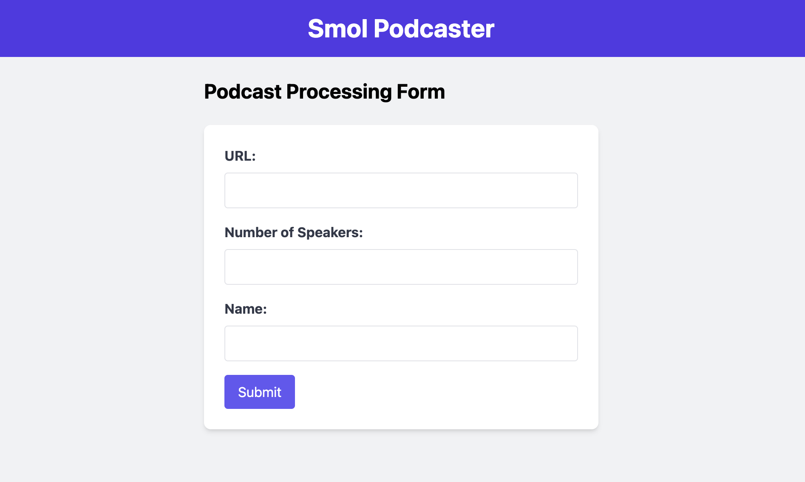

# smol-podcaster



We use smol-podcaster to take care of most of [Latent Space](https://latent.space) transcription work. What it will do for you:

- Generate a clean, diarized transcript of the podcast with speaker labels and timestamps
- Generate a list of chapters with timestamps for the episode
- Give you title ideas based on previous ones (modify the prompt to give examples of your own, it comes with Latent Space ones)
- Give you ideas for tweets to announce the podcast

### Environment Setup

Activate virtualenv with

`source venv/bin/activate`

Install dependencies with

`pip install -r requirements.txt`

Make a copy of the `.env.sample` and replace it with your keys:

`mv .env.sample .env`

### Run with web UI + background runs

If you want to run a bunch in parallel (or remotely) you can use the web UI + celery. Before running, you'll need a broker for celery ([I use RabbitMQ](https://docs.celeryq.dev/en/stable/getting-started/backends-and-brokers/rabbitmq.html)).

If you have honcho installed, simply run `honcho start`, otherwise run each command manually:

```
celery -A tasks worker --loglevel=INFO
flask --app web.py --debug run
```

Then simply go to `localhost:5000` and fill out the form. The files will be saved locally as `/podcast-results` just like the cli version.

### Run from CLI

To run:

`python smol_podcaster.py AUDIO_FILE_URL GUEST_NAME NUMBER_OF_SPEAKERS`

The URL needs to be a direct download link, it can't be a GDrive. For files <100MB you can use [tmpfiles.org](https://tmpfiles.org/) (e.g. `https://tmpfiles.org/dl/4338258/audio.mp3`), otherwise Dropbox. For example: 

`python smol_podcaster.py "https://dl.dropboxusercontent.com/XXXX" "Tianqi" 3`  

Or, if you want to use a local file (with absolute or relative paths), use the following:
```
python smol_podcaster.py audio_sample.mp3 "test" 1
```
Or, use `~/Downloads/audio_sample.mp3` for file.

The script will automatically switch https://www.dropbox.com to https://dl.dropboxusercontent.com in the link.

Optional flags:

- `--transcript_only` will generate only the transcript without any of the show notes
- `--generate_extra` will also create tweets and title ideas

### Audio / Video Sync

If you use smol-podcaster to transcribe both your audio and video files, you can create chapters based on your audio ones, put them in the form, and create a new list that matches the video transcript for YouTube. Usually audio and video have different lengths because fewer pauses are edited, so re-using the audio timestamps in the video doesn't work.

For example:

Timestamp:
`[00:10:00] Talking about Latent Space`

Audio Transcript:
`[00:10:00] We love talking about Latent Space`

Video Transcript:
`[00:12:05] We love talking about Latent Space`

Will return you new chapters where the timestamp would be
`[00:12:05] Talking about Latent Space`

This is based on string similarity, not hard-matching so don't worry about Whisper's mistakes.


# License

MIT License
